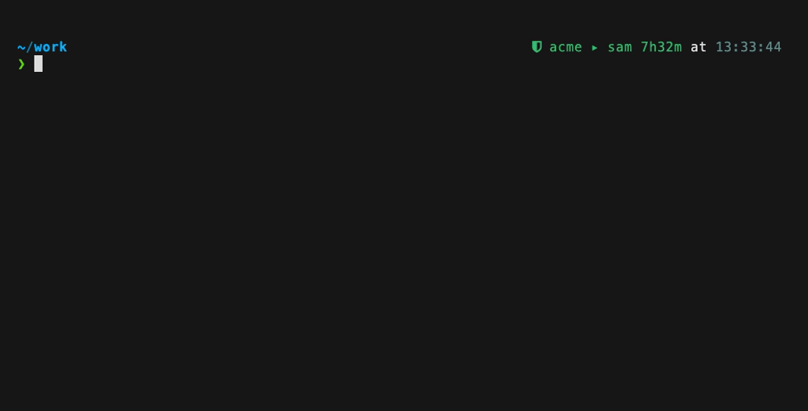

# teleport-zsh

Shell integration for [Teleport](https://goteleport.com) — think **kube-ps1 for Teleport**.

Your shell always knows which cluster you're logged into, who you are, how long
your cert has left, and whether you're running with elevated (JIT) access —
plus tab-completion that knows your actual nodes, databases, apps, and
recordings.



```
~/work                                          acme ▸ chris 7h32m
❯ tsh ssh ubuntu@<TAB>
dev-ssh-0   disk_used=18%,env=dev,hostname=dev-ssh-0,team=platform
dev-ssh-1   disk_used=18%,env=dev,hostname=dev-ssh-1,team=platform
prod-ssh-0  disk_used=18%,env=prod,hostname=prod-ssh-0,team=platform
```

The prompt segment, live:

| State | Prompt | Meaning |
|---|---|---|
| Healthy | ` acme ▸ chris 7h32m` (green) | >4h left on the cert |
| **Elevated** | ` acme ▸ bob ↑staging 5h02m` | an approved access request is assumed — the role gained is shown |
| Persona | ` acme ▸ bob 6h02m` (magenta) | this shell is a secondary identity (`TELEPORT_HOME`) |
| Expiring | ` acme ▸ chris 43m` (yellow → red) | <1h / <15m; a one-shot warning also prints |
| Logged out | ` logged out` (dim) | no live cert |

Everything is **zero-network on the prompt path** — the segment reads only
local files (`~/.tsh`), and `openssl` runs once per new cert, memoized. Render
cost is ~0.5ms.

## What's inside

- **Prompt segment** (powerlevel10k) — cluster ▸ user, cert TTL countdown,
  JIT elevation marker (`↑role`, detected from the cert itself), persona
  coloring, plus one-shot expiry warnings at <15m and at expiry.
- **Dynamic completion** for `tsh` — nodes, databases, apps, kube clusters,
  pending access requests, session recordings, and flag values
  (`--mfa-mode=`, `--db-user=`, …), with labels shown next to candidates.
  Cached per-profile (~120s TTL, background refresh — only the first TAB per
  resource type touches the network). SSH login prefixes (`ubuntu@`) come from
  your cert's principals, no network at all. Caches auto-invalidate after
  `tsh login/logout/request`.
- **Multi-profile awareness** — tsh can hold several cluster profiles at
  once; the segment appends `+N` when others exist, and `tprofiles` expands
  it: every known cluster with its identity, TTL (or `EXPIRED` / logged out),
  and an `▸` on the active one. `tsh login --proxy=<TAB>` completes known
  clusters — with a still-valid cert that switches instantly, no re-auth.
- **fzf pickers** — `tss` (node → ssh), `tdb` (database → connect),
  `tapp` (app → login), `trec` (recording → play). Each pushes the real `tsh`
  command onto history, so demos show replayable commands, not magic.
- **Persona shells** — `tpersona bob` opens a subshell with
  `TELEPORT_HOME=~/.tsh-bob`: tab title, window background tint (OSC 11 —
  iTerm2/Ghostty/Warp), iTerm2 badge, auto-login. Never confuse your admin
  terminal with a demo persona again.
- **Demo helpers** — `tlock bob` / `tunlock bob` for the
  "join live, then lock" beat (self-expiring TTL so a persona can't be left
  locked).
- **Terraform destroy guard** — intercepts `terraform destroy` /
  `apply -destroy`, shows the workspace, backend, and the Teleport proxy the
  config talks to (the blast radius), and requires typing the target's name.
  Born from a real incident.

## Requirements

- zsh ≥ 5.8, `tsh` (tested with Teleport 18.x), `openssl`, `python3`
- [powerlevel10k](https://github.com/romkatv/powerlevel10k) for the prompt
  segment (everything else works without it)
- [fzf](https://github.com/junegunn/fzf) for the pickers (optional)
- A [Nerd Font](https://www.nerdfonts.com/) for the shield icon (or set
  `TELEPORT_ZSH_ICON` to any character)
- macOS or Linux

## Install

**oh-my-zsh**

```sh
git clone https://github.com/tenaciousdlg/teleport-zsh \
  ${ZSH_CUSTOM:-~/.oh-my-zsh/custom}/plugins/teleport
```

then add `teleport` to the `plugins=(...)` array in `~/.zshrc`.

**zinit** — `zinit light tenaciousdlg/teleport-zsh`

**antigen** — `antigen bundle tenaciousdlg/teleport-zsh`

**antidote** — add `tenaciousdlg/teleport-zsh` to your plugins file

**plain zsh**

```sh
git clone https://github.com/tenaciousdlg/teleport-zsh ~/.teleport-zsh
echo 'source ~/.teleport-zsh/teleport.plugin.zsh' >> ~/.zshrc
```

**Enable the prompt segment** — add `teleport` to the elements array in
`~/.p10k.zsh`:

```zsh
typeset -g POWERLEVEL9K_RIGHT_PROMPT_ELEMENTS=(
  ...
  teleport                # Teleport cluster ▸ identity + cert TTL
  time
)
```

## Configuration

| Variable | Default | Purpose |
|---|---|---|
| `TELEPORT_ZSH_ICON` | Nerd Font shield | segment icon; set to `⛨`, `⎈`, or `''` |
| `POWERLEVEL9K_TELEPORT_<STATE>_FOREGROUND` | green/yellow/red/magenta/grey | per-state colors (`OK`, `WARN`, `CRIT`, `LOGGEDOUT`, `PERSONA_OK`, …) |
| `TELEPORT_PERSONA_PROXY` | your current cluster | default proxy for `tpersona` |
| `TPERSONA_TINT` | per-name dark color | window tint; `#rrggbb` or `off` |
| `TSH_DEMO_PERSONAS` | `bob alice` | names completed for `tpersona`/`tlock`/`tunlock` |
| `TSH_DB_USERS` / `TSH_DB_NAMES` | `writer reader` / `postgres` | values offered for `--db-user=` / `--db-name=` |
| `TELEPORT_ZSH_NO_OTHERS` | unset | set to `1` to hide the `+N` other-profiles tail |
| `TELEPORT_ZSH_NO_GUARD` | unset | set to `1` to not wrap `terraform` at all |
| `TF_DESTROY_GUARD` | on | `off` to bypass the guard per-invocation (`TF_DESTROY_GUARD=off terraform destroy …`) |

The guard never blocks non-interactive shells, so CI and scripts are unaffected.

## How elevation detection works

Teleport encodes your roles and any assumed access-request IDs into the TLS
certificate it writes to `~/.tsh` (subject `organizationName` values and OID
`1.3.9999.2.8` respectively). The plugin snapshots your roles whenever no
request is active; when a request appears in the cert, the diff against that
baseline is what you see as `↑staging`. All local, all from the cert you
already have.

## License

MIT
